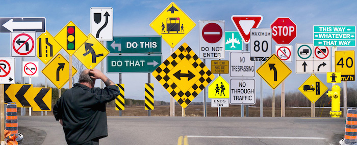

## Project: Build a Traffic Sign Recognition Program
[](http://www.udacity.com/drive)



[//]: # (Image References)

[image1]: ./images/traffic_signs.png "cover picture"
[image2]: ./images/sample_images_training_data.png "Random plot of Training images"
[image3]: ./images/distribution_training_set.png "Distribution of classes in training data set"
[image4]: ./images/distribution_validation_set.png "Distribution of classes in validation data set"
[image5]: ./images/distribution_test_set.png "Distribution of classes in test data set"
[image6]: ./images/sample_images_augmented_data.png "Random plot of augmented images"
[image7]: ./images/distribution_training_set_after_augmentation.png "Distribution of classes in training dataset after augmentation"
[image8]: ./images/distribution_validation_set_after_augmentation.png "Distribution of classes in validation dataset after augmentation"
[image9]: ./images/sample_images_after_normalization.png "Normalized images"
[image10]: ./images/model_architecture.png "Model Architecture"
[image11]: ./images/validation_accuracy.png "Validation Accuracy"
## Overview
---
The main objective of this project is to classify traffic signs using a Convolutional Neural Network (CNN). The classification model is trained based on the data from [German Traffic Sign Dataset](http://benchmark.ini.rub.de/?section=gtsrb&subsection=dataset). Given an input image of size 32x32x3, the project would classify the image as belonging to one of the 43 possible classes. The solution is implemented using the `Tensorflow` deep learning library framework.

---
## Dataset Exploration

The [German Traffic Sign Dataset](http://benchmark.ini.rub.de/?section=gtsrb&subsection=dataset) dataset consists of almost 52000 images of 43 different classes of traffic signs. The images are already cropped to 32x32 pixels containing the region of interest and labelled to their actual classification.
Furthermore, Udacity has serialized these images and their respective labels into 3 pickle files one each for the training, validation and the final test. The pickle files can be downloaded as a zip file [here](https://s3-us-west-1.amazonaws.com/udacity-selfdrivingcar/traffic-signs-data.zip). [ _Caution:The filesize is approx 120MB._ ]. In addition, Udacity has provided a [CSV file](./data/signnames.csv) which has the mapping of class identifiers to their respective readable texts.

### Summary of Dataset
In the first part of the project, the pickle files and the csv file are loaded. The summary of the loaded data is as follows:
- Number of training data = **34799**
- Number of validation data = **4410**
- Number of testing data = **12630**
- Image data shape = **(32, 32, 3)**
- Number of classes = **43**

### Exploratory Visualization
To ensure that the images are loaded properly, 42 randomly selected images from the training dataset are plotted. The title of each image is formatted with their class identifier followed by the mean and variance value of the respective image.
![plot_of_training_data][image2]

The above graphic shows that the images are not sharp due to the relatively small pixel resolution. Also the lighting conditions are varied leading to poor contrast in the images. Another issue is the **high mean and variance** of the images.

## Design and Test a Model Architecture
### Preprocessing
Before designing the data needs to preprocessed to make it suitable for deep learning. In the process of training the network, huge matrices of weights will be multiplied  and added to biases (another matrix) to cause activations that are then backpropogated with the gradients. A high value for the mean and variance of images will lead to huge computational costs and a possibility of vanishing and exploding gradients. To avoid this problem, the images needs to be normalized wherein the pixels are centered around the mean value of the image data. This process of **normalization** will be further discussed later. Before that, there is another issue which needs to be handled.

An analysis on the distribution of classes with in the datasets shows a huge under-representation of some classes.
![class_distribution_of_training_data][image3]
The above graphic illustrates the imbalance in the class distribution. For example, the class "Speed Limit 50kmph" is represented by more than 2000 images, while the "Speed Limit 20kmph" is represented by less than 200 images. Similar under-representation of classes is also seen in the validation and test datasets.
![class_distribution_of_validation_data][image4]
Although the test dataset shows this discrepanies, for the purpose of the test data set, the case of class under-represetation is not an issue. So no further action is required for test dataset.
![class_distribution_of_test_data][image5]

Before the training, the under-representation of the classes in training and validation datasets needs to be compensated using **image augmentation techniques**.

#### Image Augmentation
Image Augmentation is the process of taking images that are already in a training dataset and adjusting them to create many adapted versions of the same image. This project uses `keras` deep learning library for augmenting images:
1. First the `ImageDataGenerator(...)` function from `keras.preprocessing.image` is called with the list of parameters describing the adaptations that had to be performed on the images.
```python
datagen = ImageDataGenerator( rotation_range=5,
width_shift_range=0.1, height_shift_range=0.1,
zoom_range=0.1, fill_mode='nearest')
```
2. For every class of traffic signs (`i`), extract the "Real" images from the Training set
```python
  X_real = X_train[y_train == i]
  y_real = np.repeat(i, X_real.shape[0])
```
3. Pass on this filtered train set to the `Flow()` function to generate `batch_size` of new images(`x`) and label (`y`)
```python
# Configure batch size and retrieve one batch of images
for x,y in datagen.flow(X_real, y_real, batch_size=len(y_real), seed=i):
    #append the generated images and labels to "Pseudo" array
    _X_pseudo = np.concatenate((_X_pseudo, x), axis = 0)
    _y_pseudo = np.concatenate((_y_pseudo, y), axis = 0)
  ```
4. Repeat the `flow()` function until the count of images per class reaches the threshold of `2500`
5. The steps 2 to 4 are repeated for every class to ensure that the overall distribution of the images is balanced.

A randomly selected images from the Pseudo Training set is shown below:
![plot_of_augmented_data][image6]

#### Splitting Training and Validation data
After the augmentation the statistics on the datasets are as follows:
- Training samples before augmentation : 34799
- Validation samples before augmentation : 4410
- Training samples after augmentation : **107500**
- Validation samples after augmentation : **4410**

As seen above, the training set has an average of 2500 images per class, the amount to 107500. But the proportion between Training samples and validation sample is heavily skewed. To balance the proportion of training and validation data, the `split_train_test()` function from `sklearn.model_selection` is used.
```python
from sklearn.model_selection import train_test_split
# Random state with an integer will produce the same results across different calls
X_train, X_valid, y_train, y_valid = train_test_split( X_train, y_train,
test_size=0.2, shuffle=True, random_state=0)
```
After the splitting, the count of datasets are as follows:
- Training samples after splitting : **86000**
- Validation samples after splitting : **21500**

A final verification of the class distribution shows that the augmentation and the following train, test split has been effective:
![class_distribution_of_augmented_data][image7]
![class_distribution_of_augmented_data][image8]

#### Serializing the augmented images
As an option, if the flag `use_augmented_datafile` is set to `True`, the augmented training data can be saved to a compressed pickle file. In this mode, instead of the standard training set, the compressed file with augmented data will be used for loading the training set. This was done only to save time during development time. This part is not part of the project goal.

#### Image Normalization
As discussed earlier, for a faster convergence of the network, we need to normalize the images. In this project, the images are normalized using the min-max method. The pixel values are scaled to have values between 0 to 1. The pixel with maximum value will be 1, the pixel with min value will be 0.
```python
result[index] = np.array((gray - np.min(gray)) / (np.max(gray) - np.min(gray)))
```   
The above normalization would lead to a smaller standard deviation as shown in the below picture.
![random_plot_of_norm_images][image9]
Now, the data is ready for deep learning.

### Model Architecture
The model is implemented based on the [LeNet-5](http://yann.lecun.com/exdb/lenet/) neural network architecture.

#### Input
The LeNet architecture accepts a 32x32xC image as input, where C is the number of color channels. After the pre-processing step, the images still retains the color depth of 3. Hence C is 3 in this case.

#### Architecture
![Model architecture][image10]
**Layer 1: Convolutional.** The starting point is a convolutional layer with `16 filters` (filter-depth), each filter sliding (more precisely 'convolving') a patch of `5x5 kernal` kernel across the `32x32x3 input image`. This layer uses `valid` padding with a `stride of 1`. The dimensions of the **output** of this layer will therefore be **28x28x16**, which is the so-called feature map that predicts the class to which each feature belongs. Since the parameters are shared across this spatial arrangement, the number of parameters will be filter size *(5x5x3) x 16 filter = 1210 Weights + 16 Biases = 1216 parameters*

**Activation:** Next, the output of the convolutional layer is activated with a RELU activation function, which adds non-linearity to the neural network

**Pooling:** Next, the output from the activation layer is pooled using the *max-pooling* method with the most commonly used `kernel size of 2x2` and `stride size of 2x2` which gives a pooling **output of 14x14x16**. This pooling layer helps to reduce the number of parameters, memory footprint and amount of computation in the network. In addition, it helps to control overfitting. The pooling layer does not introduces any new parameters since it computes a fixed function of the input.

**Layer 2: Convolutional** The network then runs through `another set of convolutional layer with 64 filters and patch size of 5x5, RELU activation and a max-pooling layer` giving an output of **5x5x64**. The number of parameters in this layer will be filter size * (5x5x16) x 64 filter = 25600 weights + 64 biases = 25664 parameters*

**Flatten.** The output is flattened into a vector. The length of the vector is *5x5x64 = 1600*.

**Layer 3: Fully Connected.** The vector is then passed on to a fully connected (FC) layer with a width of **240**, each representing a probability that a certain feature belongs to a label. The fully connected layer goes through its own backpropagation process to determine the most accurate weights. Each neuron receives weights that prioritize the most appropriate label. In simple words, while the Convolution layer extracts the feature maps, the fully connected layers classifies those extracted features. *(Wx + b)*

**Activation.** The above FC layer is followed by a RELU activation function *g(Wx + b)*. In the previous FC layer, the function *(Wx + b)* results in a linear projection from the input to the output. RELU function introduces non-linearity to the network again.

**Dropout.** A dropout layer with `60% keep probability` is added after the RELU activation layer. This means that there is a 40% change that the output of a given neuron will be forced to 0. This avoid over-fitting of the network. This layer was added after noticing that the validation accuracy was not improving after 3 or 4 epochs. There was progressive improvement in validation accuracy after including the drop-outs.

**Layer 4: Fully Connected.** The output of the dropout layer to connected to the second fully connected layers with a width of  **84 outputs**, each representing a probability that a certain feature belongs to a label

**Activation.** As before, to remove the non-linearity, a RELU activation layer is added.

**Dropout.** Similar to layer 4, a dropout layer with `60% keep probability` is added after the RELU activation layer.

**Layer 5: Fully Connected (Logits).** This final layer returns the un-normalized predictions (logits) of the model, with a **output of 43**, each representing the logit values for a particular class.

#### Output
The model return the logits from the layer 5. A `softmax` function should be run on this value to map the result between 0 to 1. This will be discussed later.

#### Parameter Summary
The table below summarizes the parameters of the model:

|Layer|Output Shape|Param #|
|:--- |:--- |---:|
|**Layer1**-Convolution(Conv2D)|(None, 28, 28, 16)|1,216|
|RELU Activation|(None, 28, 28, 16)|0|
|Max pooling|(None, 14, 14, 16)|0|
|**Layer2**-Convolution(Conv2D)|(None, 10, 10, 64)|25,664|
|RELU Activation|(None, 10, 10, 64)|0|
|Max pooling|(None, 5, 5, 64)|0|
|Flatten|(None, 1600)| 0|
|**Fully Connnected Layer1**|(None, 240)|384,240|
|RELU Activation|(None, 240)|0|
|Dropout|(None, 240)|0|
|**Fully Connnected Layer2**|(None, 84)|20,244|
|RELU Activation|(None, 84)|0|
|Dropout|(None, 84)|0|
|**Final fully Connnected Layer3**|(None, 43)|3,655|
|   |**Total parameters:**  | 435,019|

### Model Training
#### Initialization of Weights
The standard (recommended) method of truncated normal distribution is used for initializing the weights. In this method, the weights will be distributed around 0 and any values farther than twice the standard deviation (-0.2 and 0.2) will be truncated.
```python
mu = 0
sigma = 0.1
conv1_W = tf.Variable(tf.truncated_normal(shape=(5, 5, 3, 16), mean = mu, stddev = sigma))
..
..
conv2_W = tf.Variable(tf.truncated_normal(shape=(5, 5, 16, 64), mean = mu, stddev = sigma))
..
..

```
#### Key aspects
| Parameter| Value| Description|
|:--- |:--- |:---|
| Dropout layers | keep_prob=0.6 | 2 Dropout layers after RELU in the FC layers led to a faster convergence and high validation accuracy of 99.6% |
| Batch Normalization | False | Project targets were met by adding dropout layers.  |
| Optimizer| Adam | |
| Batch size | 128   | |
| Epochs | 20 | |
| Learning Rate | 0.001 | No adaptive learning rate |

### Solution Approach
1. First, proper tensors are prepared to feed in the input values to our model.
```python
x = tf.placeholder(tf.float32, (None, 32, 32, 3))
y = tf.placeholder(tf.int32, (None))
```
2. The prepared tensors are then passed onto a **Training Pipeline** which starts with a call to the adapted LeNet model. The model returns the `logits` which is an unscaled output of earlier layers. The function `tf.nn.softmax_cross_entropy_with_logits()` computes the cross entropy of the result after applying the softmax function. In simple terms, `tf.nn.softmax_cross_entropy_with_logits` normalizes the logits so that the output can be interpreted as probabilities.
```python
logits  = LeNet_adapted(x)
cross_entropy = tf.nn.softmax_cross_entropy_with_logits(labels=one_hot_y, logits=logits)                
```
3. After creating the network, the loss is calculated and optimzier is attached to optimize the loss
```python
loss_operation = tf.reduce_mean(cross_entropy)
optimizer = tf.train.AdamOptimizer(learning_rate = rate)
training_operation = optimizer.minimize(loss_operation)
```
4. Once the training pipleine is prepared, a `tensorflow` session is created. All the required tensors are initialized and training pipeline is run with the call to `sess.run()`  
```python
with tf.Session() as sess:
        sess.run(tf.global_variables_initializer())
        ...
        ...
        for i in range(EPOCHS):
            X_train, y_train = shuffle(X_train, y_train)
            for offset in range(0, num_examples, BATCH_SIZE):
                end = offset + BATCH_SIZE
                batch_x, batch_y = X_train[offset:end], y_train[offset:end]
                sess.run([training_operation], feed_dict={x: batch_x, y: batch_y, keep_prob:0.6 })
        ...
        ...
```
5. After the batch processing of the training is complete, the accuracy of the training and validation is calculated with the call to `evaluate(X_data, y_data)`

### Final Results
The validation accuracy during the training phase is plotted in the below figure:
![validation_accuracy][image11]

A summary of the accuracy metrics is shown in the below table:

| Parameter| Accuracy|
|:--- |:--- |
|Training| 100% |
|Validation| 99.4% |
|Test | 96.4%  |

## Test model on new images
### Acquiring new images
### Performance on new images
### Model Certainty - Softmax Probabilities
